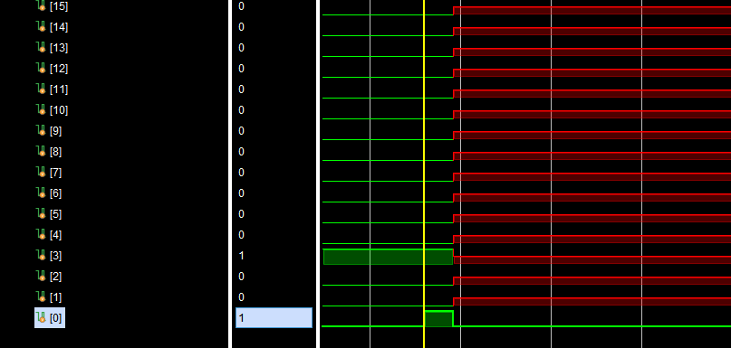

# FHW: HLS Haskell to hardware compiler

This is a repository containing `fhw` compiler from: http://www1.cs.columbia.edu/~sedwards/papers/edwards2019fhw.pdf. The ultimate purpose is to transform a haskell program with arbitrary recursion into a dataflow representation and eventually into System Verilog. 

# Contents

1. [Project structure](#ps)
2. [Build and run](#build_and_run)
3. [Full-fledged example](#ffe)

<a name="ps"> </a>
# Project structure

```
.
|-- .github
|   `-- workflows
|-- .gitignore
|-- AUTHORS
|-- Dockerfile # Dockerfile with needed dependencies
|-- LICENSE
|-- README.md # This readme
|-- Setup.hs
|-- examples
|   |-- List
|   `-- sample-test.sv # Mock SystemVerilog testbench
|-- fhw
|-- fhw.cabal
|-- fhw.code-workspace
|-- libraries
|   |-- base
|   |-- build
|   |-- check-hcr
|   |-- fhw
|   |-- fhw.sv
|   |-- ghc-prim
|   |-- includes
|   |-- integer-gmp
|   `-- primops.txt
|-- src
|   |-- Dfc #dataflow-to-SystemVerilog
|   |-- Dfc.hs
|   |-- Fhw # Haskell-to-dataflow
|   |-- Fhw.hs
|   |-- README

```

<a name="build_and_run"> </a>
# Build and run

The project heavily depends on features available in GHC 7.6.3 but which were consequently removed in future versions. Hence the simpliest way to build it is to use the `Dockerfile`  provided:

```bash
docker build . -t fhw:latest 
```

Then there are two options:

- Clone the repository into the Docker container
- Mount the directory into the Docker container

The first option limits the development capabilities, since only GHC 7.6.3 is available inside the container. Hence the second option is preferable (it could be less performant though):

```bash
docker run -it --rm -v ${pwd}:"/home/fhw" fhw:latest
```

The project will be in "/home/fhw" directory of the container. To build the project `cd` there and run:

```bash
cabal configure --enable-tests
cd libraries && ./build
cd .. && cabal build
cd libraries && ./check-hcr 
```

Executables are `dist/build/Dfc/dfc` and `dist/build/Fhw/fhw` respectively. `./fhw` is a bash script to ease the parameter passing to the `fhw` executable. E.g.

```bash
./fhw --dotfile <path-to-.hs-file> # will produce .df(dataflow representation) file
dist/build/Dfc/dfc -v --modulename=<name of the .sv module> <path-to-.df-file> > module.sv # will generate SystemVerilog code 
```

<a name="ffe"> </a>
# Full-fledged example
------------------------------
The example will consider transforming a recursive function that counts the length of the list  into `SystemVerilog` module and successive simulation using `Vivado`.


The example `.hs` file is `MeLength.hs` in `./examples/List/ListLength`:

```haskell
module MyList where

data MyList = Nil | Cons Int MyList

myLength :: MyList -> Int
myLength Nil = 0
myLength (Cons _ xs) = 1 +  (myLength xs)

main :: Int
main = (myLength (Cons 22 (Cons 33 (Cons 42 (Cons 42 Nil)))))
```

`[]` list constructor from `Prelude` is supported, but here `MyList` is defined to show the support of arbitrery data types.

So,

```bash

cd ./examples/List/ListLength
../../../fhw --dataflow MyLenth.hs # will generate `MyLenght_linked.hcr.df`, which is a dataflow representation
../../../dist/build/Dfc/dfc -v --modulename="MyLength" MyLenth_linked.hcr.df > MyLength.sv # will produce SystemVerilog file
```

`MyLength.sv` contains the following module definition:

```verilog
//MyLength.sv

module MyLength(
  input logic clk,
  input logic reset,
  input Go_t sourceGo_d,
  output logic sourceGo_r,
  output Int_t \lizzieLet1_1I#_dout ,
  input logic \lizzieLet1_1I#_rout 
  );
```

That is it outputs an `Int_t`, namely the length of the list. Combining it with the sample testbench from `./examples/sample-test.sv` we get the following:

```verilog

//test.sv

`timescale 1ns/1ps

module test;

logic clk; //innput
logic reset; // input

//input
Go_t sourceGo_d;
logic \lizzieLet1_1I#_rout ;

//output
Int_t \lizzieLet1_1I#_dout ;
logic sourceGo_r;

MyLength DUT(
  .clk(clk),
  .reset(reset),
  .sourceGo_d(sourceGo_d),
  .sourceGo_r(sourceGo_r),
  .\lizzieLet1_1I#_dout (\lizzieLet1_1I#_dout ), //spaces are important here
  .\lizzieLet1_1I#_rout (\lizzieLet1_1I#_rout ) 
  );

initial begin
  
 sourceGo_d = Go_dc(1'd0);
 \lizzieLet1_1I#_rout = 1'b1;   
 
end


always begin
    clk = 1'b1;
    #8;
    clk = 1'b0;
    #8;
    
end

always begin
    reset = 1'b1;
    #16;
    reset = 1'b0;
    sourceGo_d = Go_dc(1'd1);
    wait(sourceGo_r == 1);
    #16;
    sourceGo_d = Go_dc(1'd0);
    
    wait(1 == 2); //wait till the end

end


endmodule

```

Then start the simulation and search for the lowest bit of `\lizzieLet1_1I#_dout` being valid, namely `1`. Other bits makes the length of the list:



As it could be seen the list's length is 4 (if we ommit the valid bit).
